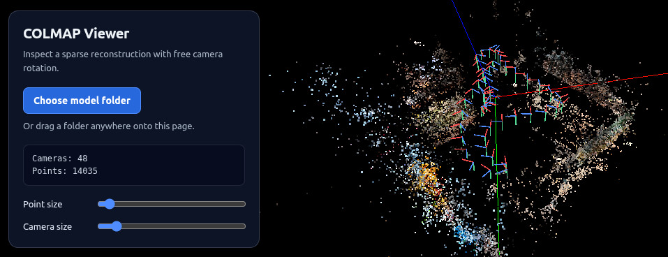

# EasyGaussianSplatting

An end-to-end pipeline for turning Insta360 360° captures into Gaussian Splatting
reconstructions, using COLMAP's native spherical (equirectangular) camera model to
reconstruct directly from panoramic frames.

## Running the full pipeline in one command

`scripts/run_pipeline.sh <input.insv> [frame_rate] [output_size] [gs_iterations] [gs_resolution]`
runs on the host and drives the container itself, chaining stitching, frame
extraction, COLMAP reconstruction, and GGPS training in a single
`docker run --gpus all`. `input.insv` must live under the repo checkout (it
gets bind-mounted as `/workspace`). `frame_rate` defaults to 2, `output_size`
to `8000x4000`, `gs_iterations` to `30000`, `gs_resolution` (a COLMAP-style
downsample factor) to `1`:

```
scripts/run_pipeline.sh data/VID_xxx.insv 2 4000x2000
```

Results land next to the capture, in `<capture_name>_reconstruction/`:
`pano.mp4` (the stitched video), `pano_mapping/sparse` (the COLMAP sparse
model), and `pano_mapping/ggps_output` (the trained model). Set
`DOCKER_IMAGE` to use a locally built image instead of the published one.



## Status

This branch is a ground-up remake of the pipeline. What's done so far:

- [x] Docker image with COLMAP, the Insta360 Media SDK, and ExifTool
- [x] Script to stitch raw Insta360 footage into equirectangular video
- [x] Script to run COLMAP reconstruction with the spherical camera model
- [x] Script to train a Gaussian Splatting model from the reconstruction (GGPS)
- [ ] Export/viewer wired to the above

## What's in the Docker image

Built from `artifacts/docker/dev.dockerfile`:

- **COLMAP** (>= 4.1.0), built with native `EQUIRECTANGULAR` camera model support,
  so panoramic frames can be reconstructed directly without reprojecting to
  perspective views first.
- **Insta360 Media SDK**, exposed as `insta360_media_stitcher`, for stitching raw
  `.insv`/`.lrv` footage into a panorama video or image sequence.
- **ExifTool**, for reading GPS/timestamp metadata off the source footage.
- A `ggps` conda environment with [GGPS](https://github.com/Insta360-Research-Team/GGPS)
  (panoramic Gaussian Splatting training) and its compiled CUDA extensions.

## Getting the image

Pull the image CI publishes on every push to `master`:

```
docker pull ghcr.io/mapmindai/gaussiansplatting:latest
```

Or build it locally from your checkout:

```
cd artifacts/docker
docker build -f dev.dockerfile -t easygaussiansplatting:dev .
```

## Using the tools

See [doc/tools.md](doc/tools.md).

## Running the reconstruction script in Docker

`scripts/colmap_reconstruct.sh` needs the repo checkout itself (for
`mapping/extract_images.py`), not just your data, so mount the whole checkout
instead of only `data/`:

```
docker run -it --rm -v $(pwd):/workspace -w /workspace \
  ghcr.io/mapmindai/gaussiansplatting:latest \
  scripts/colmap_reconstruct.sh data/pano.mp4 2
```

Or drop into a shell and run it interactively:

```
docker run -it --rm -v $(pwd):/workspace -w /workspace \
  ghcr.io/mapmindai/gaussiansplatting:latest bash

scripts/colmap_reconstruct.sh data/pano.mp4 2
```

The sparse model lands in `data/pano_mapping/sparse` on the host, since
`/workspace` is a bind mount of your checkout.

## Training a Gaussian Splatting model

`scripts/ggps_train.sh <reconstruction_dir> [iterations] [resolution]` trains
a model with [GGPS](https://github.com/Insta360-Research-Team/GGPS) from a
`colmap_reconstruct.sh` output directory (the one containing `images/` and
`sparse/0/`). `iterations` defaults to `30000`, `resolution` (a COLMAP-style
downsample factor) to `1`:

```
docker run -it --rm --gpus all -v $(pwd):/workspace -w /workspace \
  ghcr.io/mapmindai/gaussiansplatting:latest \
  scripts/ggps_train.sh data/pano_mapping 30000 2
```

The trained model lands in `<reconstruction_dir>/ggps_output/`. Export/viewer
integration isn't wired yet — see Status.
